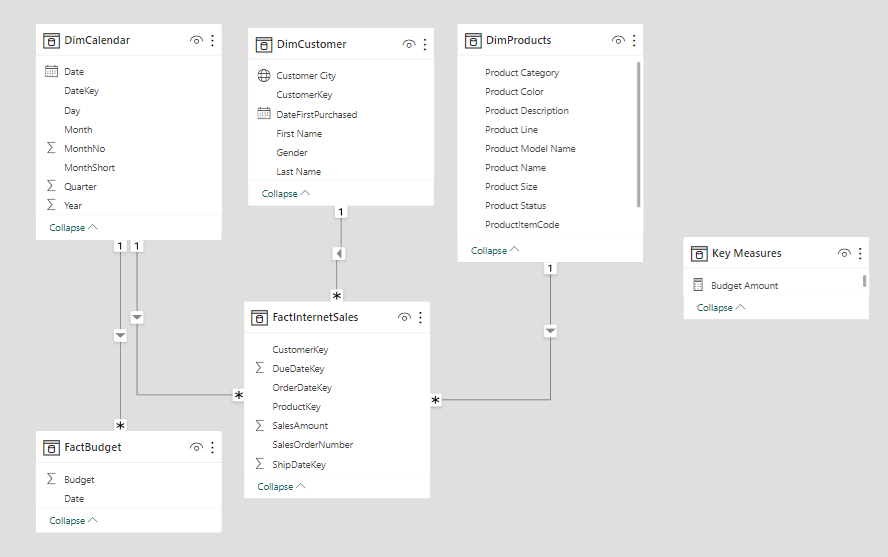

[Home](https://ts863716.github.io/)

### Housing Project using SQL and Power BI 

The goal of this project was to get a better understanidng of the housing market and the current trajectory we are heading towards. I wanted to find out if the market is going to continue to rise or if housing prices are starting to fall and try to find any relations.

The 3.25 GB and 1,229,602 row dataset was downloaded from [here](https://www.redfin.com/news/data-center/)

## Data Cleansing & Transformation (SQL)

To create the necessary data model for doing our analysis and fulfilling the requirements above, the following tables were extracted using SQL

```sql
-- Cleaning up table DimDate with info we dont need and selecting the date from 2019 and up
SELECT [DateKey]
      ,[FullDateAlternateKey] AS Date
      ,[EnglishDayNameOfWeek] AS Day
      ,[EnglishMonthName] AS Month
      ,LEFT([EnglishMonthName], 3) AS MonthShort
      ,[MonthNumberOfYear] AS MonthNo
      ,[CalendarQuarter] AS Quarter
      ,[CalendarYear] AS Year
FROM [AdventureWorksDW2019].[dbo].[DimDate]
WHERE CalendarYear >=2019
```

```sql
--Cleaned the DimCustomer table
SELECT c.[CustomerKey] AS CustomerKey
      ,c.[FirstName] AS [First Name]
      ,c.[LastName] AS [Last Name]
      ,CASE c.[Gender] WHEN 'M' THEN 'Male' WHEN 'F' THEN 'Female' END AS Gender
      ,c.[DateFirstPurchase] AS DateFirstPurchased
      ,g.City AS [Customer City] -- Joined in Customer City from the Geography Table
FROM DimCustomer AS c LEFT JOIN DimGeography AS g on g.GeographyKey = c.GeographyKey
ORDER BY CustomerKey ASC
```

```sql
SELECT p.[ProductKey]
      ,p.[ProductAlternateKey] AS ProductItemCode
      ,p.[EnglishProductName] AS [Product Name]
      ,ps.EnglishProductSubcategoryName AS [Sub Category]
      ,pc.EnglishProductCategoryName AS [Product Category]
      ,p.[Color] AS [Product Color]
      ,p.[Size] AS [Product Size]
      ,p.[ProductLine] AS [Product Line]
      ,p.[ModelName] AS [Product Model Name]
      ,p.[EnglishDescription] AS [Product Description]
      ,ISNULL (p.Status, 'Outdated') AS [Product Status]
FROM [DimProduct] AS p
LEFT JOIN DimProductSubcategory AS ps ON ps.ProductSubcategoryKey = p.ProductSubcategoryKey
LEFT JOIN DimProductCategory AS pc ON ps.ProductCategoryKey = pc.ProductCategoryKey
ORDER BY p.ProductKey ASC
```

```sql
SELECT [ProductKey]
      ,[OrderDateKey]
      ,[DueDateKey]
      ,[ShipDateKey]
      ,[CustomerKey]
      ,[SalesOrderNumber]
      ,[SalesAmount]
FROM [FactInternetSales]
WHERE OrderDateKey >= 2019 --Could also do LEFT (OrderDateKey, 4) >= YEAR(GETDATE()) - 2
ORDER BY OrderDateKey ASC
```
## Data Model

Below is a screenshot of the data model after the the cleansed tables were imported into Power BI.

This data model also shows how our Budget excel has been connected to our other tables.



## Sales Management Dashboard

The sales management dashboard is an overview of the main requirements needed in the business request.


