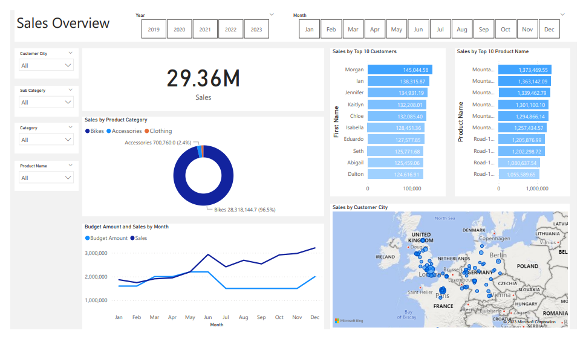

# Data Analyst

#### Technical Skills: Python, SQL, Power BI

## Education			        		
- B.S., Mathematics | Ohio University (_May 2022_)

## Work Experience
**Suspense Analyst @ Nationwide (_March 2022 - Present_)**
- Use Power BI to create reports and dashboards for Nationwide departments and stakeholders as requested
- Participate in meetings with stakeholders to get requirements needed for projects

## Projects
### Business Project using SQL and Power BI 
[Project Link](https://ts863716.github.io/BusinessProject)

Using a business request as a scope of requirements, created a Power BI dashobard with data extracted from a SQL Server using SSMS.

### Etsy Business Sales Dashboard
[Project Link](https://ts863716.github.io/EtsyProject)

Used Power BI and Etsy sales data from a woodworking business to create insights.

### Housing Data Dashboard
[Project Link](https://ts863716.github.io/HousingProject)

Used Power BI and Housing Sales data to create insights.

